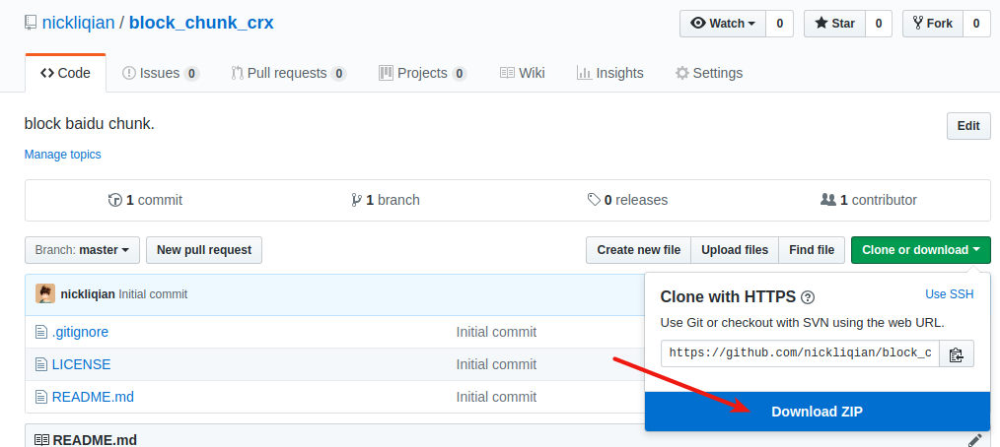
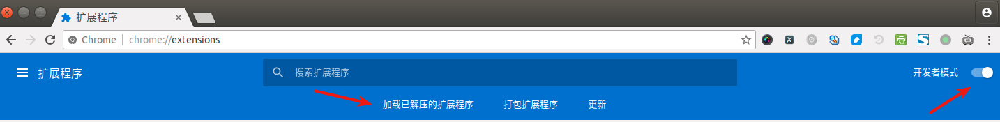
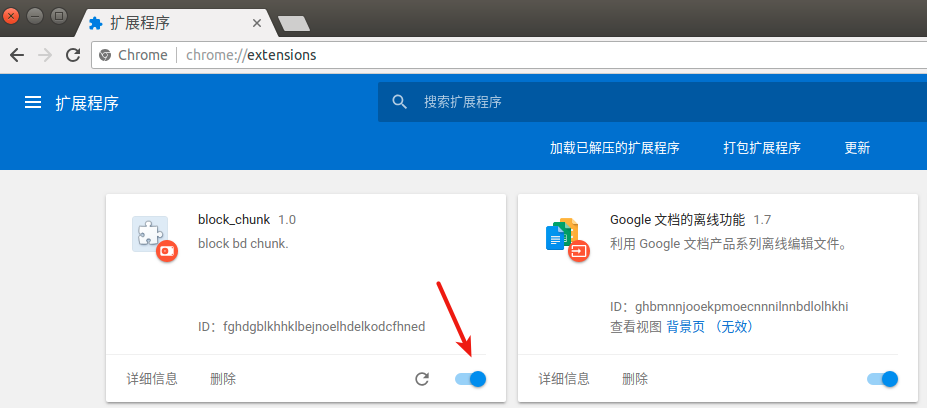
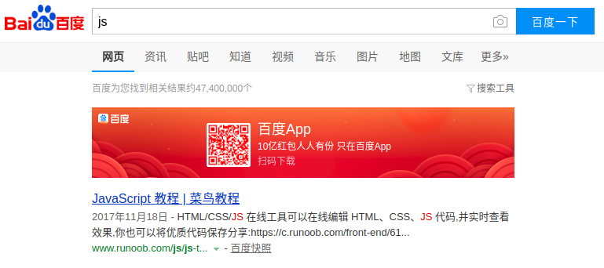
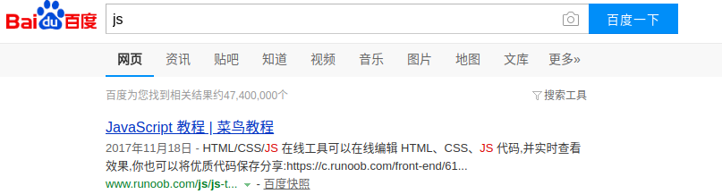

# block_chunk_crx
block baidu chunk.

# 1 下载
  
or
```
git clone https://github.com/nickliqian/block_chunk_crx.git
```
然后解压文件.  

# 2 打开谷歌浏览器
在地址栏输入`chrome://extensions/`  
打开`开发者模式`  
点击`加载已经解压的扩展程序`, 选择`block_chunk_crx`解压后的目录  
  
插件添加进来后,确保插件是打开的状态  
  

# 3 效果
打开插件前:  
  
打开插件后:  
  